[](https://www.microchip.com)

## Microstep

<br>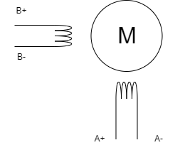
<br>Bipolar Stepper Motor

<br>This example presents a bipolar stepper drive, using Half-Step, Full-Step and Microstep methods.


## Full-Step Mode
<br>In Full-Step mode, the motor rotates complete mechanical steps at once - for a standard 200 full-steps/revolution stepper motor, this would be 1.8 degrees for a sub-step. The motor's two coils are powered sequentially in four full-steps. The sequence determines the stepper motor's direction of rotation. Full-Step mode is simple to control, but can cause vibration and noise due to the larger step angle. Another drawback of using this mode is that the stepper motor's current consumption is at the highest level, having the lowest efficiency. This mode is often used in applications where the drive algorithm simplicity is more important than the smoothness of operation or precision.

## Half-Step Mode
<br>In Half-Step mode, four extra steps are inserted between the four initial full-steps, which makes the stepper motor rotate by half of its full-step angle. This effectively doubles the number of mechanical steps per revolution - for a standard 200 full-steps/revolution stepper motor, this would be 0.9 degrees for a complete step, resulting in a smoother operation and less vibration compared to the Full-Step mode. 
<br>The benefits of having a balance between simplicity, efficiency, smoothness of operation
and a lower current consumption outweigh the increased complexity of the control algorithm needed for this
mode. It also provides double resolution of the Full-Step mode.


## Microstep Mode
<br>The Microstep mode divides the full-step angle into even smaller steps, providing even smoother operation and higher precision. The number of microsteps per full-step can vary, but common values are 8, 16, 32, or even 256 microsteps per full-step. Even though this mode requires the most complex control algorithms, the current consumption is lower than in Full-Step and Half-Step modes, providing the highest precision, the least vibration and less noise. Microstep mode is often used in applications where precision and smoothness of operation are paramount, such as in CNC machines.


## Related Documentation

More details and code examples on the AVR16EB32 can be found at the following links:

- [AVR<sup>®</sup> EB Product Page](https://www.microchip.com/en-us/products/microcontrollers-and-microprocessors/8-bit-mcus/avr-mcus/avr-eb?utm_source=GitHub&utm_medium=TextLink&utm_campaign=MCU8_AVR-EB&utm_content=avr16eb32-bipolar-stepper-motor-drive-github&utm_bu=MCU08)
- [AVR<sup>®</sup> EB Code Examples on GitHub](https://github.com/microchip-pic-avr-examples?q=AVR16EB32)


## Software Used

- [MPLAB® X IDE v6.20 or newer](https://www.microchip.com/en-us/tools-resources/develop/mplab-x-ide?utm_source=GitHub&utm_medium=TextLink&utm_campaign=MCU8_AVR-EB&utm_content=avr16eb32-bipolar-stepper-motor-drive-github&utm_bu=MCU08)
- [AVR-Ex DFP-2.9.197 or newer Device Pack](https://packs.download.microchip.com/)
- [MPLAB® XC8 compiler v2.46](https://www.microchip.com/en-us/tools-resources/develop/mplab-xc-compilers?utm_source=GitHub&utm_medium=TextLink&utm_campaign=MCU8_AVR-EB&utm_content=avr16eb32-bipolar-stepper-motor-drive-github&utm_bu=MCU08)
- [MPLAB® Code Configurator (MCC) v 5.5.0](https://www.microchip.com/en-us/tools-resources/configure/mplab-code-configurator?utm_source=GitHub&utm_medium=TextLink&utm_campaign=MCU8_AVR-EB&utm_content=avr16eb32-bipolar-stepper-motor-drive-github&utm_bu=MCU08)


## Hardware Used

- [AVR<sup>®</sup> EB Curiosity Nano](https://www.microchip.com/en-us/development-tool/EV73J36A?utm_source=GitHub&utm_medium=TextLink&utm_campaign=MCU8_AVR-EB&utm_content=avr16eb32-bipolar-stepper-motor-drive-github&utm_bu=MCU08)
- Multi-Phase Power Board (MPPB)
- AVR-EB Curiosity Nano Adaptor to MPPB
- Motor used in the application: 17HS8401S Stepper Motor, but not mandatory
- A Voltage Power Supply (6-50V and 1-3A current capability, depending on the chosen motor)


<br>The AVR16EB32 Curiosity Nano Development board is used along with the MPPB, AVR-EB Cnano to MPPB Adaptor Board, one stepper motor and a voltage power supply.
<br>Adjust the supply voltage and the current limit according to the stepper motor used. 

<br>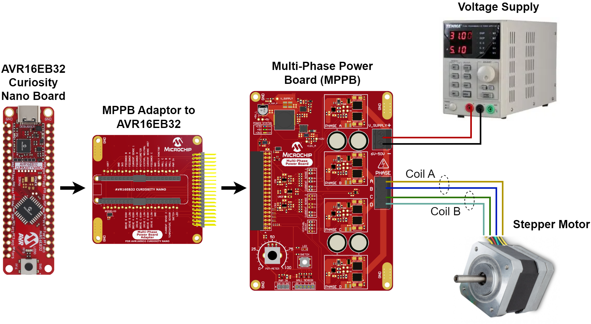
<br>Hardware used


## Functionality

<br>The application is periodically calling the ```Stepper_Move``` function with the parameters:
initial position, steps (to go) and delay (speed).

<br>The function returns the stepper motor final position after the movement.
<br>The stepper drive schema is controlled by the ```StepAdvance``` function. ```StepAdvance``` is generating a wave 90 electrical degrees shifted.

### Full-Step
<br>
<br>Ideal waveforms of the current that flows through the coils. Each full-step represents a stepper motor mechanical movement of 1.8 degrees.

<br>Full-Step: four full-steps sequence
<br>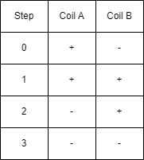


<br>For a better aproximation, we are inserting intermediary steps, called half-steps.
### Half-Step
<br>
<br>Ideal waveforms of the current that flows through the coils. Each half-step represents a stepper motor mechanical movement of 0.9 degrees.

<br>Half-Step: eight half-steps sequence
<br>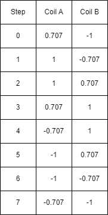
<br>Note: 0.707 represents sin(45 degrees) or cos(45 degrees).
<br>[Back to Top](#microstep)


## Microstep
<br>To obtain a smoother movement and better positioning, the driving waveform is an approximation of a sinewave.
<br>In the current implementation, the 1.8 degrees precision of the full-step are divided into 32 microsteps, resulting in a microstepping precision of less than 0.06 degrees.

<br>
<br>Ideal waveforms of the current that flows through the coils.
<br>[Back to Top](#microstep)


## Configuration

<br>**Note**: for a standard 200 full-steps/revolution stepper motor,  1.8 mechanical degrees represent 360 electrical degrees (360 electrical degrees/200-steps is 1.8 mechanical degrees).

<br>The motor parameters can be configured in ```stepper.h```. 

<br>The ```AMPLITUDE_DRIVE``` parameter sets the amplitude of the sine wave signal, ranging from 0 to 1.0 and is invers proportional with the power supply voltage(vbus) and direct proportional with the coil resistance and with the desired current consumption level. ```AMPLITUDE_DRIVE``` = desired current consumption * coil resistance / power supply voltage.
<br>For example:<br> ```AMPLITUDE_DRIVE``` = 1.0[A] * 2.5[ohm] / 10[V] = 0.25

<br>The ```AMPLITUDE_STALL``` parameter represents 10-20% of ```AMPLITUDE_DRIVE```.

<br>The ```STEP_SIZE``` parameter is fixed and it represents the step angle of the stepper used in Full-Step mode. For this application, a stepper motor with 200 steps / mechanical revolution is used. 360 mechanical degrees/revolution divided by 200 steps results in 1.8 mechanical degrees/step.

<br>The application contains an option that allows the stepper coils to still remain energized after the steper motor has finished the movement. The user can enable/disable this functionality with the help of the ```RELEASE_IN_IDLE``` flag.
<br>The flag is by default ```true```, which means that after every movement the current through the coils is stopped. If the user needs the coils to remain energized while the motor is idle, the ```RELEASE_IN_IDLE``` flag must be set to ```false```.

<br>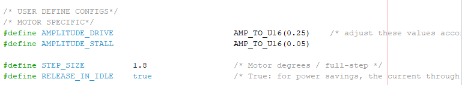

<br> To change the stepping mode, uncomment the corresponding macro in ```stepper.h```.
<br>
<br>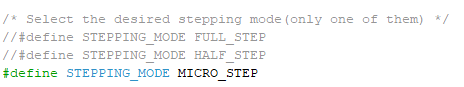
<br>[Back to Top](#microstep)


## Flowchart

<br>Flowchart for the ```Stepper_Move``` function
<br>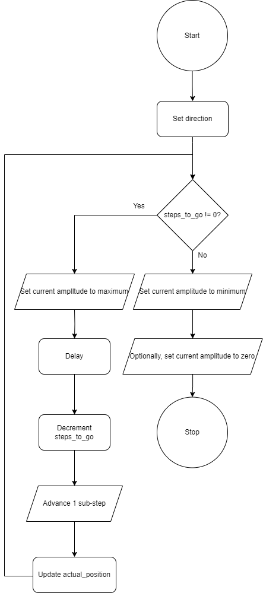

<br>Sub-step division:
<br>1 full-step = reference
<br>1 half-step = 1/2 full-step
<br>1 microstep = 1/32 full-step
<br>[Back to Top](#microstep)


## Setup

<br>To generate this project using MPLAB X IDE and the MPLAB X Code Configurator (MCC) with Melody (MCC Clasic is not supported for this device), follow the next steps:

<br>1. Open MPLAB X IDE and create a new project for the AVR16EB32 device.

<br>2. Open MCC from the toolbar (more information on how to install the MCC plug-in can be found [here](https://onlinedocs.microchip.com/pr/GUID-1F7007B8-9A46-4D03-AEED-650357BA760D-en-US-6/index.html?GUID-D98198EA-93B9-45D2-9D96-C97DBCA55267)).

<br>3. From the **MCC Content Manager** tab click the **Select MCC Melody** button and then click **Finish**.<br>
<br>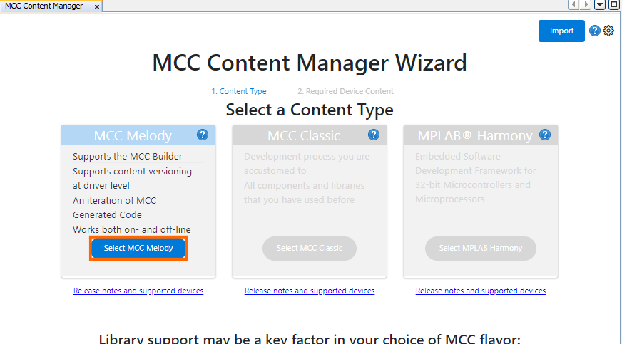
<br>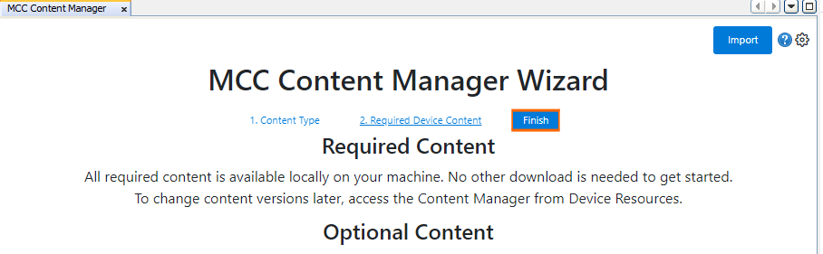

<br>4. Click _Project>Resources>System>CLKCTRL_, then do the following configuration:
<br>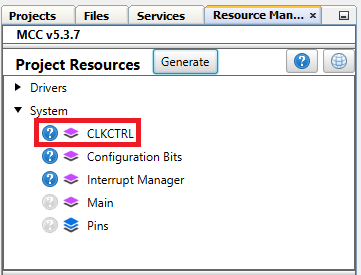
    <br> - Disable the Prescaler enable button
<br>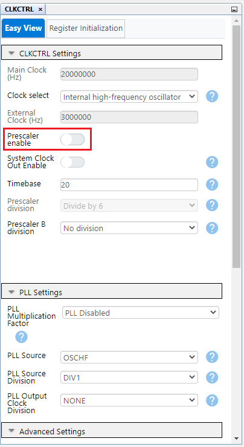

<br>5. To add the TCE module, go to _Device Resources>Drivers>Timer>TCE0_, then do the following configuration:
<br>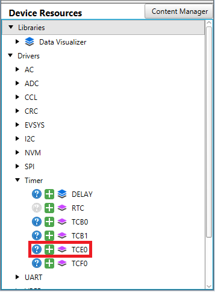
    <br>  - Module Enable: Must be enabled by default, if not just toggle the button (it turns blue if enabled)
    <br>  - Clock Selection: System clock (by default the divider must be 1 - System clock)
    <br>  - Counter Direction: UP
    <br>  - Waveform Generation Mode: Single-Slope PWM mode with overflow on TOP
    <br>  - Requested Period [s]: 0.00005
    <br>  - Duty Cycle 0 [%]: 0
    <br>  - Duty Cycle 1 [%]: 0
    <br>  - Duty Cycle 2 [%]: 0
    <br>  - Duty Cycle 3 [%]: 0
    <br>  - Waveform Output n: Check the boxes from the Enable column for Waveform Output 0, 1, 2, 3
    <br>  - Scale mode: CMP values are scaled from Bottom, 50% DC (duty cycle)
    <br>  - Scaled Writing to registers: Normal
    <br>  - Amplitude Control Enable: Toggle the button (it turns blue if enabled)
    <br>  - Amplitude Value: 1
<br>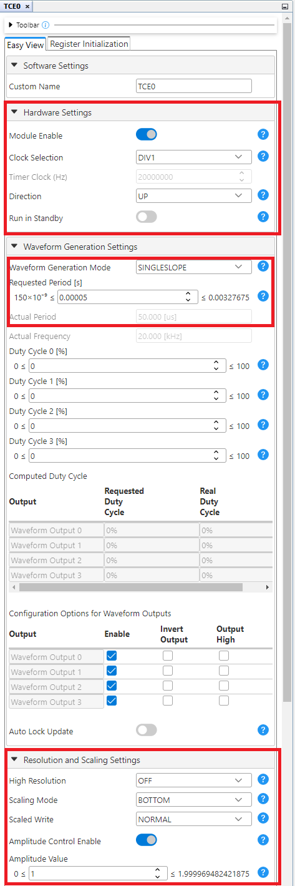

<br>7. To add the WEX module, go to _Device Resources>Drivers>WEX>WEX0_, then do the following configuration:
<br>
  <br> - Input Matrix: Direct
  <br> - Update Source: TCE (the update condition for the output signals will be dictated by TCE)
  <br> - Override Settings: Check all the boxes from the Output Enable column for the Waveform Output [0-7]
  <br> - Dead-time Insertion Channel 0 Enable: Toggle the button (it turns blue if enabled)
  <br> - Dead-time Insertion Channel 1 Enable: Toggle the button (it turns blue if enabled)
  <br> - Dead-time Insertion Channel 2 Enable: Toggle the button (it turns blue if enabled)
  <br> - Dead-time Insertion Channel 3 Enable: Toggle the button (it turns blue if enabled)
  <br> - Requested Dead-time Low Side (μs) : 0.2
  <br> - Requested Dead-time High Side (μs) : 0.2
<br>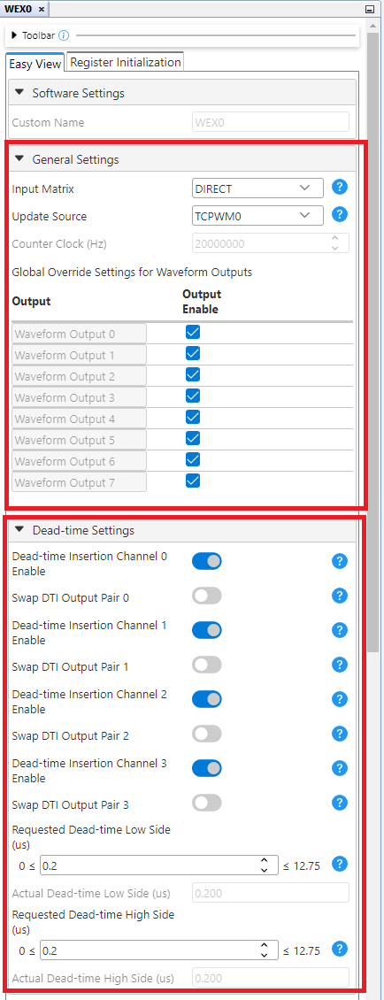

<br>8. In the **Pin Grid View** tab check if the WEX_WO [0-7] pins are locked as outputs on PORTA. When the boxes from the Enable column in the Output Settings of WEX are checked, the pins are also locked. To change the PORT simply click a pin from another PORT in **Pin Grid View**. 

 |            Pin           |     Configuration     |
 | :---------------------:  | :----------------:    |
 |            PA0           |   TCE and WEX WO0     |
 |            PA1           |   TCE and WEX WO1     |
 |            PA2           |   TCE and WEX WO2     |
 |            PA3           |   TCE and WEX WO3     |
 |            PA4           |   TCE and WEX WO4     |
 |            PA5           |   TCE and WEX WO5     |
 |            PA7           |   TCE and WEX WO6     |
 |            PA7           |   TCE and WEX WO7     |


<br>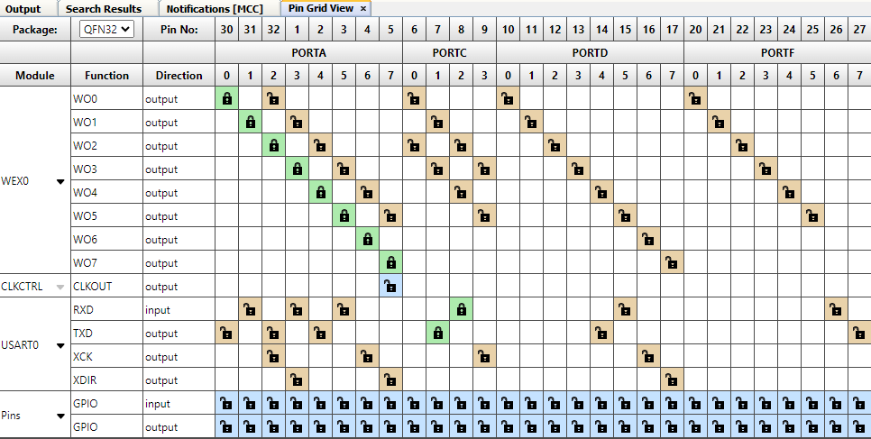

<br>9. To add the BOD module, go to _Device Resources>System>BOD_, then do the following configuration:
<br>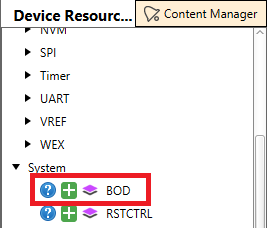
<br> -BOD Operation in Active Mode: Enabled in continuous mode
<br> -BOD Level: 2.7V
<br> -BOD Operation in Sleep Mode: Disabled
<br>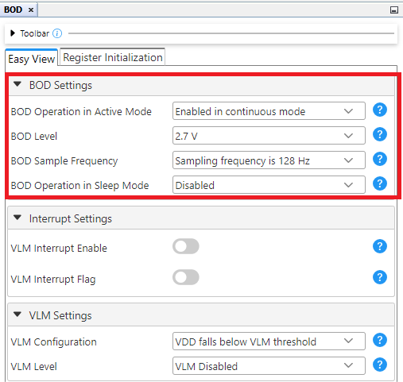

<br>10. To add the UART module, go to _Device Resources>Drivers>UART>UART0_, then do the following configuration:
<br>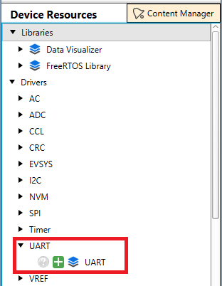
<br>- Requested Baudrate: 115200
<br> -Redirect Printf to UART Enable: Toggle the button (it turns blue if enabled)
<br>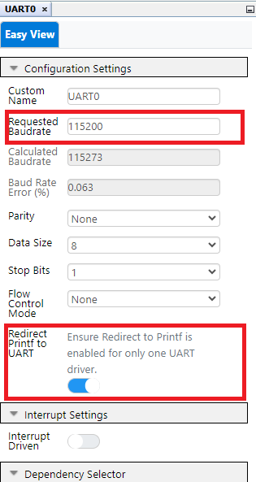

<br>11. In the **Project Resources** tab, click the **Generate** button so that MCC will generate all the specified drivers and configurations.
<br>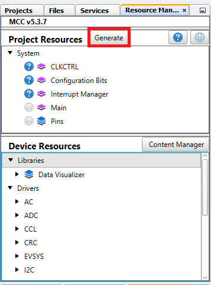

<br>12. Add the ```main.c```, ```stepper.c``` and ```stepper.h``` files to the project.
<br>[Back to Top](#microstep)


## Operation

<br>**Caution:**
<br>Do not change power supply voltage during the stepper movement. The application does not implement any protection for over-current.

1. Be sure the power supply is turned off.

2. Adjust the voltage of the power supply according to the stepper motor specs.

3. Adjust the current limit of the power supply according to the stepper motor specs.

4. Connect the power supply to the MPPB.

5. Connect the AVR16EB32 board the the MPPB Adapter.

6. Connect the MPPB Adapter to the MPPB.

7. Connect the AVR16EB32 board to the PC.

8. Open the ```avr16eb32-stepper-microstepping-mcc.X``` or solution in MPLAB X IDE.

9. Right click the project and select Set as main project.

<br>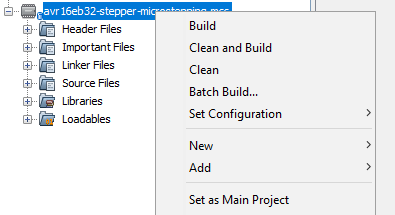

10. Build the ```avr16eb32-stepper-microstepping-mcc.X``` project by clicking **Clean and Build Project**.

<br>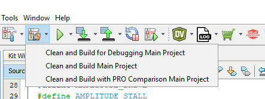

11. Click **Make and Program Device** to program the project to the board.

<br>

12. Start the power supply.
<br>[Back to Top](#microstep)


## Results

<br>On the terminal, the information about the movement of the stepper is shown.
<br>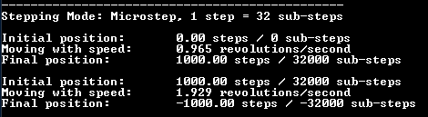
<br>Screen capture from Microstep configuration.
<br>
<br>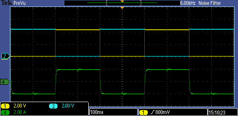
<br>Full-Step
<br>
<br>
<br>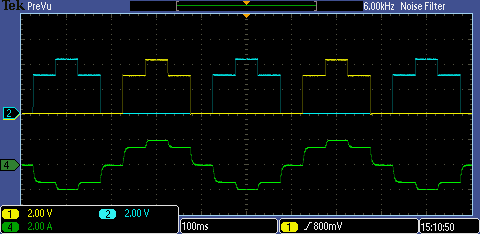
<br>Half-Step
<br>
<br>
<br>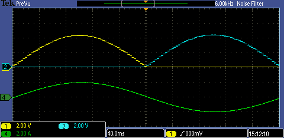
<br>Microstep
<br>
<br>Colours in the figures:
<br>Yellow and blue represent the voltages at the two ends of coil A,
<br>Green represents the current through coil A.
<br>
<br>On all three traces a low pass filtering from the oscilloscope is applied. This removes the PWM artifacts and makes visible the short time average values.
<br>[Back to Top](#microstep)


## Summary

<br>This application shows how to drive in Full-Step or Half-Step or Microstep a stepper motor using AVR16EB32, MPPB, MPPB Adapter and a power supply.

<br>[Back to Top](#microstep)
<br>[Back to Related Documentation](#related-documentation)
<br>[Back to Software Used](#software-used)
<br>[Back to Hardware Used](#hardware-used)
<br>[Back to Functionality](#functionality)
<br>[Back to Configuration](#configuration)
<br>[Back to Flowchart](#flowchart)
<br>[Back to Setup](#setup)
<br>[Back to Operation](#operation)
<br>[Back to Results](#results)
<br>[Back to Summary](#summary)